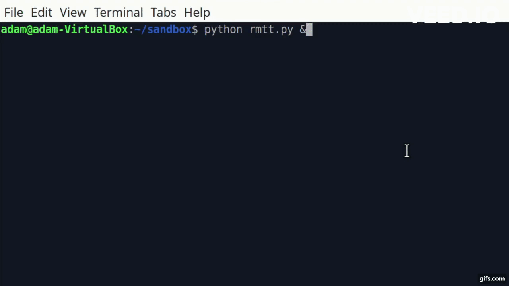

# rolling-multicolor-terminal-text

### About

    A Python script that cycles through background colors for text in the terminal.

### Requirements

    - Linux
    - Python 3

### How to Use

    To start the script, run the following command in your terminal:

        `python rmtt.py &`

    To stop the script, press Ctrl + C.

### Preset Configuration

    Colors:

        colors = [
            93, 99, 105, 111, 117, 123, 122, 121, 120, 119, 118, 190, 226, 220, 214, 208, 202, 130, 131, 132, 138, 144, 150, 156, 120, 14, 108, 102, 96, 90, 91, 92
        ]
    
    Time:

        time.sleep(0.1)
        
### How to Customize

    Colors:
    
        You can customize colors, and the order in which they appear, by changing the values in the `colors` array using the table below as a guide.

    Time:
    
        You can also change the time between color changes by changing the parameter in the `time.sleep()` function.

Image Source: [Wikimedia Commons](https://commons.wikimedia.org/wiki/File:Xterm_256color_chart.svg), CC BY-SA 3.0

    
### Author

Adam Martinez  
https://github.com/admart128/  
https://twitter.com/admart128  
